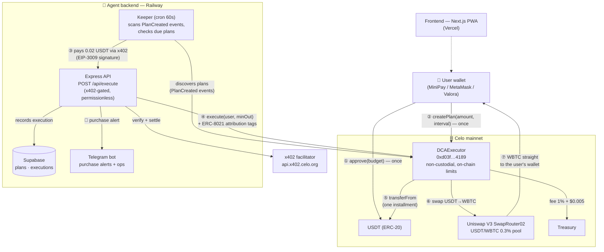

# CompraBTC

**Non-custodial Bitcoin DCA agent on Celo.** Define your plan once — *$X every hour/day in BTC* — and an on-chain agent buys Bitcoin for you, straight into your own wallet. Funds never leave your wallet between purchases.

- **Live app:** https://comprabtc.vercel.app (works in MiniPay and any injected wallet)
- **Agent API:** https://comprabtc-production.up.railway.app (`GET /` service descriptor · `GET /api/stats` public metrics)
- **Built for the** [Celo Agentic Payments & DeFAI Hackathon](https://celobuilders.xyz) — [leaderboard](https://dune.com/celo/agentic-payments-defai-hackathon)

## Deployed contracts (Celo mainnet, chain 42220)

| Contract | Address |
|---|---|
| **DCAExecutor** (verified) | [`0xd03ffeBBCaaA8aA21053eEB0EeAde39EFC504189`](https://celoscan.io/address/0xd03ffeBBCaaA8aA21053eEB0EeAde39EFC504189) |
| USDT (token in) | [`0x48065fbBE25f71C9282ddf5e1cD6D6A887483D5e`](https://celoscan.io/address/0x48065fbBE25f71C9282ddf5e1cD6D6A887483D5e) |
| WBTC — native bridge (token out) | [`0x8aC2901Dd8A1F17a1A4768A6bA4C3751e3995B2D`](https://celoscan.io/address/0x8aC2901Dd8A1F17a1A4768A6bA4C3751e3995B2D) |
| Uniswap V3 SwapRouter02 | [`0x5615CDAb10dc425a742d643d949a7F474C01abc4`](https://celoscan.io/address/0x5615CDAb10dc425a742d643d949a7F474C01abc4) |

Swaps route through the USDT/WBTC 0.3% Uniswap V3 pool. Protocol fee: **1% + $0.005 flat** per execution, with on-chain hard caps (≤1%, ≤$0.05 flat) and a revert if the fee would ever eat the installment.

Agent identity: **ERC-8004 #9665** on Celo mainnet ([8004scan](https://www.8004scan.io/agents/celo/9665)). Every transaction carries ERC-8021 attribution tags.

## How it works



1. The user approves USDT to `DCAExecutor` (cap = total plan budget) and creates a plan with on-chain limits (amount per run, minimum interval). Cancelling = one click (`cancelPlan` or `approve(0)`).
2. The keeper discovers plans from `PlanCreated` events, and each cycle pays the execution API with an **x402** micropayment before calling `execute()` — so every purchase is also an agent-to-agent payment.
3. On-chain limits mean even a compromised keeper can't overcharge: it can never pull more than `amountPerRun` or execute before `minInterval` elapses.
4. Users get Telegram alerts on every purchase (link from Settings in the app).

## Repository layout

| Directory | What it is |
|---|---|
| [`contracts/`](contracts/) | `DCAExecutor.sol` (Foundry) — 21 tests incl. mainnet fork tests, deploy script |
| [`backend/`](backend/) | Express API + keeper loop (viem) + x402 middleware + Supabase + Telegram bot |
| [`frontend/`](frontend/) | Next.js PWA (wagmi/viem) — MiniPay auto-connect, plan creation, BTC portfolio |
| [`docs/`](docs/) | Unit economics, copy review |
| [`PLAN.md`](PLAN.md) | Full architecture plan and piece-by-piece feasibility verification |

## Running locally

**Frontend** (needs `NEXT_PUBLIC_EXECUTOR_ADDRESS`, `NEXT_PUBLIC_API_URL`, `NEXT_PUBLIC_ATTRIBUTION_CODE`, `NEXT_PUBLIC_TELEGRAM_BOT` in `frontend/.env.local`):

```bash
cd frontend && pnpm install && pnpm dev   # http://localhost:3000
```

**Backend + keeper** (Node 22; see `backend/src/config.ts` for required env vars — executor address, keeper key, Supabase credentials, x402 API key; DB schema in `backend/supabase/schema.sql`):

```bash
cd backend && pnpm install && pnpm dev    # API on :8080, keeper ticks every 60s
```

**Contracts:**

```bash
cd contracts && forge test                # unit + Celo mainnet fork tests
forge script script/Deploy.s.sol --rpc-url celo --broadcast --verify --interactives 1
```

## Hackathon tracks

- **Track 1 — on-chain revenue:** protocol fee charged inside `execute()`, every tx tagged with ERC-8021 attribution.
- **Track 2 — x402 payments:** the keeper pays `/api/execute` per run via the Celo x402 facilitator. The endpoint is permissionless — any agent can pay to trigger an execution.
- **Track 4 — Aigora:** agent registered on the Aigora marketplace (#395) + feedback PRs at [trionlabs/aigora-skills](https://github.com/trionlabs/aigora-skills).

## License

MIT
